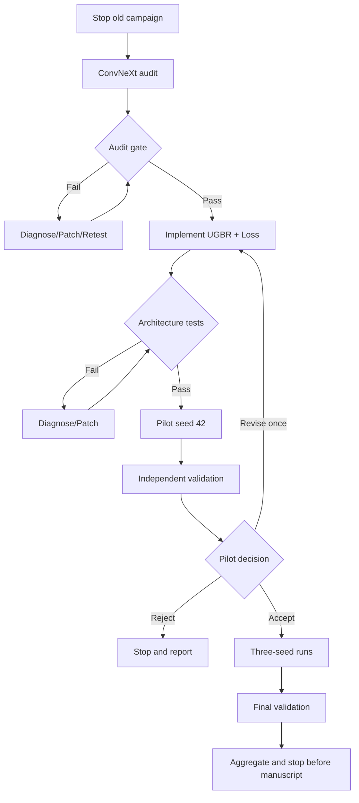

# Graph Engineering

## Design rules

- هر node یک مسئول و یک خروجی قابل اعتبارسنجی دارد.
- transition فقط با PASS مستقل Validation و Review انجام می‌شود.
- nodeهای GPU هم‌زمان نیستند.
- read-only auditها می‌توانند parallel باشند؛ writeها exclusive هستند.
- terminal nodeهای صریح: COMPLETE، STOP_AND_REPORT، BLOCKED.

## Mermaid

